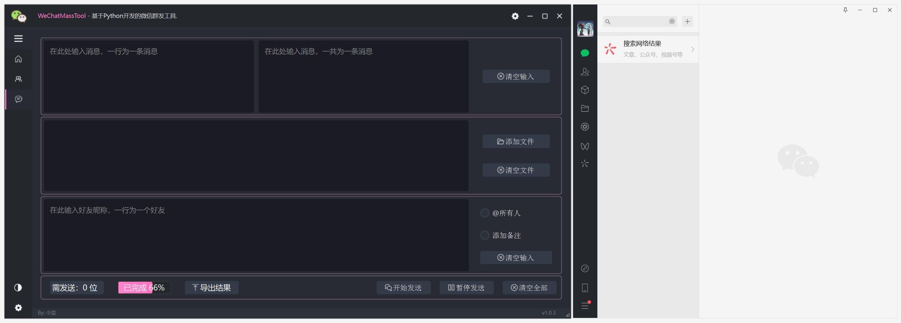

<div align="center" height="256" width="256">
    <h1 style="font-size:36pt; font-weight:600; color:#ff79c6;">WeChatMassTool</h1>
<br>


</div>
<p><b>🔥微信群发工具：</b>完全免费开源使用的一款微信群发消息工具，现功能有：导出好友标签名单、导出运行结果、导入好友标签名单发送，因调用Windows API，发送速度嘎嘎快！</p>
<p>⭐只支持Windows系统用户使用，可以前往 <a href="https://github.com/Frica01/WeChatMassTool/releases"><b>Release</b></a> 下载已编译的 exe 程序，无需安装，开箱即用。</p>
<p>✨最最最重要的一点是：不会封号！不会封号！！不会封号！！！安全。不像使用 `WeChat Hook` 的，有封号的风险。</p>


# 微信群发工具

## 📖目录
- [项目简介](#项目简介)
- [快速启动](#快速启动)
- [动图展示](#动图展示)
- [支持项目](#支持项目)
- [特性](#特性)
- [项目结构](#项目结构)
- [拓展](#拓展)
- [联系作者](#联系作者)
- [贡献](#贡献)
- [许可证](#许可证)

## ⭐项目简介
微信群发助手是一个基于 `PySide6` 和 `Python` 开发的桌面应用程序，旨在帮助用户高效地执行微信消息的群发任务。它提供了一个友好的用户界面，支持导入群发名单和导出运行结果。

## ⚡快速启动
>本项目使用 `Python` 和 `PySide6`，确保你已经安装了 `Python 3.12+` 和 `PySide6`

<br>

1. 克隆仓库到本地
   ```bash
   git clone https://github.com/Frica01/WeChatMassTool.git
   ```
<br>

2. 安装依赖环境
   ```bash
   pip install -r requirements.txt
   ```
<br>

3. 运行应用
   ```bash
   python main.py
   ```

## ✨动图展示

<details>
<summary><b>展开</b></summary>


### 启动界面


### 基本展示


### 运行展示




</details>

## 注意事项


**推荐屏幕配置**

为了确保在导出标签好友名单时本软件能在您的设备上达到最佳性能，请使用以下屏幕配置：
- **分辨率**：1920x1080
- **缩放率**：100%


如果你发现在导出标签好友时候，导出的好友的数量与实际标签好友的数量不一致，原因有以下：
- 好友昵称重复（不可解）
- 你的屏幕配置不是推荐的配置（设置成推荐配置）


## 🧐支持项目

如果您觉得这个项目有用，不妨给它一个⭐（`Star`）。`Star`对我来说是一种鼓励，也能帮助更多的开发者发现这个工具。

如果您希望跟踪最新的更新和改进，请`Fork`🍴本项目。`Fork`可以让您保持对项目更新的同步，并有机会贡献自己的改进和新功能。

## 特性
<font size=6 color=Violet>简要说明：</font>
- **采用 MVC 架构**：通过模型（Model）、视图（View）和控制器（Controller）的分离，实现了逻辑与界面的解耦，为项目的后续维护和扩展打下了坚实基础。
- **易于扩展**：MVC架构设计让添加新功能变得更加容易和直接，无需修改大量现有代码即可实现功能的扩展。
- **功能抽象化**：将项目中的常用功能和组件抽象成独立的模块和函数，提高了代码的复用性，同时也简化了功能的修改和升级过程。


### 已开发

- [x] **用户友好的界面**：基于 `PySide6`，拥有现代化的界面和流畅的用户体验。
- [x] **智能群发**：可以根据用户设置的标签或群组进行智能群发。
- [x] **丰富的消息内容**：支持文本、图片、文件等多种类型的消息内容。
- [x] **日志记录**：详细记录每次发送的结果，方便用户回查。
- [x] **断点续传**：导入发送的名单中途停止或发送失败，在下次导入时候从失败的点继续发送。


### 待开发
- [ ] **消息模板**：增加更多自定义消息模板。
- [ ] **消息定时**：消息的定时发送功能。

## 项目结构

<details>
<summary><b>展开</b></summary>

```md
WeChatMassTool/
├── assets/              # 展示图片
├── config/              # 应用配置相关文件
│   ├── __init__.py
│   └── config.py        # 应用的全局配置设置
├── controllers/         # MVC 中的控制器组件
│   ├── __init__.py
│   └── controller_main.py
├── make/                # pyinstaller打包文件
├── models/              # MVC 中的模型组件，处理数据逻辑
│   ├── __init__.py
│   ├── model_generator_csv.py
│   └── model_main.py
├── tests/               # 单元测试和功能测试文件
│   ├── __init__.py
│   └── test.py
├── utils/
│   ├── __init__.py
│   ├── utils.py
│   └── wx_operation.py
├── views/               # MVC 中的视图组件，用户界面文件
│   ├── resources/       # UI 资源，如图标、图片等
│   │   ├── icons/
│   │   ├── images/
│   │   ├── svgs/
│   │   ├── themes/      # UI 主题文件
│   │   ├── ui_files/    # Qt Designer UI 文件
│   │   └── resources.qrc
│   ├── ui_components/   # 重用的UI组件和逻辑
│   │   ├── __init__.py
│   │   ├── animations.py  # 动画效果实现
│   │   └── ui_setup.py    # UI设置和初始化
│   ├── ui_designs/      # UI 设计文件，基于PySide6自动生成的Python文件
│   │   ├── __init__.py
│   │   ├── resources_rc.py
│   │   ├── ui_login.py    # 登录界面UI设计
│   │   └── ui_main.py     # 主界面UI设计
│   ├── widgets/         # 自定义的Qt Widgets
│   │   ├── __init__.py
│   │   ├── custom_grips.py  # 自定义窗口调整大小控件
│   │   ├── login_window.py  # 登录窗口实现
│   │   └── main_window.py   # 主窗口实现
│   ├── __init__.py
│   └── view_main.py     # 主视图管理器，负责整合和管理应用的所有视图
├── LICENSE
├── README.md
├── main.py              # 应用程序的入口文件
└── requirements.txt

```
</details>

## 拓展
此项目目前支持基础的群发功能，未来的版本计划包括：
- 增加更多自定义消息模板。
- 用户行为分析和使用反馈功能，用于改善应用性能和用户体验。

## ☎联系作者
如果您有任何问题或者想要更多地了解项目，欢迎通过以下方式联系我：
- 微信公众号：小菜的Python杂货铺 [扫码关注公众号](./assets/WeChat_Official_Account.jpg)
- QQ群聊：[扫码加入群聊](./assets/QQ_group.png)
- 在GitHub上 [提交Issue](https://github.com/Frica01/WeChatMassTool/issues)

## 贡献
本项目的灵感来源自 [**Frica01**](https://github.com/Frica01) 的创意和贡献，我对他在开源社区的工作表示由衷的景以和感谢。本项目基于以下两个项目的重构。
- [https://github.com/Frica01/WeChat-mass-msg](https://github.com/Frica01/WeChat-mass-msg)
- [https://github.com/Frica01/PinnacleQt_GUI_PySide6_PyQt6](https://github.com/Frica01/PinnacleQt_GUI_PySide6_PyQt6)


欢迎对项目感兴趣的开发者通过 [Pull Requests](https://github.com/Frica01/WeChatMassTool/pulls) 或 [Issues](https://github.com/Frica01/WeChatMassTool/issues) 提交您的贡献或反馈。

## 许可证
该项目在 MIT 许可证下开源。更多详情请查阅 GitHub 仓库中 [LICENSE](LICENSE) 文件。
